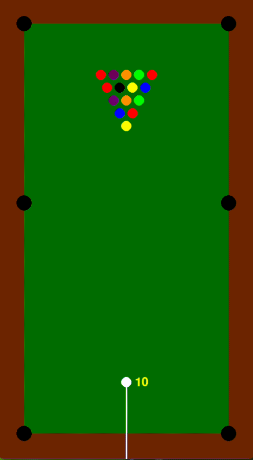

# Pool Game

A simple pool game implemented in Python using the Pygame library. The game simulates a basic version of pool with collision detection, ball movement, and a cue stick for aiming and striking the cue ball.

## Features

- **Basic Pool Mechanics**: Includes a table, balls, and holes.
- **Cue Stick**: Allows aiming and setting the speed of the cue ball.
- **Collision Detection**: Handles ball collisions and wall bounces.
- **Speed Control**: Adjust the speed of the cue ball.

2. **Controls**

   - **Arrow Keys**: Adjust the angle of the cue stick.
   - **Up/Down Keys**: Increase or decrease the speed of the cue ball.
   - **Spacebar**: Strike the cue ball with the current speed and angle.
   - **Escape Key**: Exit the game.

3. **Gameplay**

   - Use the cue stick to aim and hit the white cue ball.
   - The white ball will move in the direction of the cue stick with the set speed.
   - Balls will bounce off the walls and each other.
   - The game simulates friction and ball collisions.

